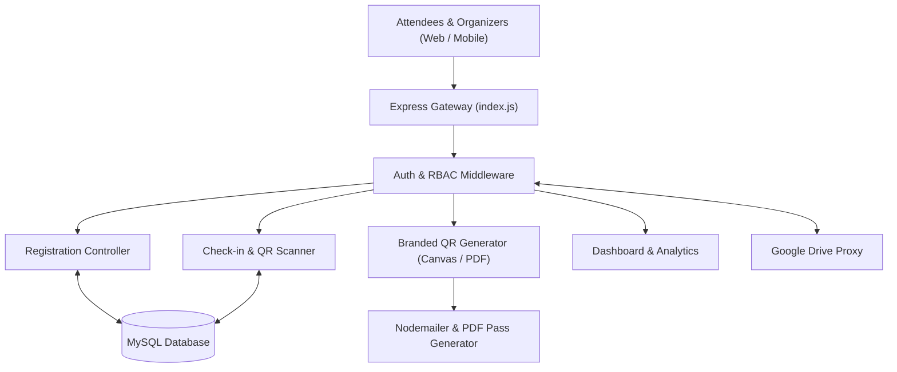

# 🎟️ FestEase Backend — Festival & Event Management SaaS Platform

[](https://nodejs.org/)
[](https://expressjs.com/)
[-4479A1.svg)](https://www.mysql.com/)
[](https://paseto.io/)
[](https://pptr.dev/)
[](#license)

**FestEase Backend** is a scalable Node.js/Express REST API powering the FestEase event and festival management SaaS platform. It handles attendee registration, bulk CSV/Excel delegate imports, automated branded QR badge generation, encrypted ticket scanning & validation, volunteer role assignment, Google Drive media synchronization, and comprehensive analytics.

---

## 🚀 Key Features

- 🎫 **Dynamic QR Ticket Engine**:
  - Generates custom-branded QR codes embedded with logos and security encryption via Node Canvas and QRCode.
  - Supports bulk pre-generation and ZIP archive downloading (`jszip`).
  - Implements PASETO and JWT-based token decryption for fast offline and online ticket check-ins.
- 👥 **Multi-Tenant SaaS Attendee Management**:
  - Public registration portals for festivals and individual venues.
  - Bulk attendee upload via Excel (`xlsx`) and CSV (`csv-parse`).
  - Categorized delegates (VIP, Media, General, Crew) with customizable check-in permissions.
- 🏢 **Role-Based Access Control (RBAC)**: Fine-grained middleware authorization supporting SuperAdmin, Festival Admin, Event Manager, Volunteer, and Scanner roles.
- 📧 **Automated Communication**: Sends branded HTML confirmation emails with QR badge attachments and PDF passes using Nodemailer and PDFKit.
- 🗄️ **Database Migration Runner**: Built-in migration suite (`migrations/runner.js`) ensuring automated schema evolution.
- ☁️ **Media Asset Proxy**: Google Drive integration for streaming and proxying festival promotional assets securely.

---

## 🏗️ Architecture



---

## 📂 Project Structure

```
festease_backend/
├── config/
│   └── db.js                      # MySQL connection pool configuration
├── controllers/
│   ├── authController.js          # User & SaaS authentication, OAuth & tokens
│   ├── checkinController.js       # QR check-in processing & live stats
│   ├── dashboardController.js     # Festival metrics & dashboard analytics
│   ├── driveController.js         # Google Drive proxy for media assets
│   ├── qrController.js            # QR generation, bulk packaging & decryption
│   ├── registrationController.js  # Attendee registration & bulk CSV imports
│   ├── systemController.js        # Health checks, DB tables & config info
│   ├── venueController.js         # Festival venue management
│   └── volunteerController.js     # Volunteer onboarding & role assignments
├── index.js                       # Express app entrypoint, middleware & error handling
├── middlewares/
│   ├── authMiddleware.js          # JWT authentication middleware
│   ├── authorizeRole.js           # RBAC permission enforcer
│   └── validate.js                # Request validation
├── migrations/                    # Automated database migration files
│   └── runner.js                  # CLI Migration execution script
├── models/                        # MySQL Data Access Objects (User, Event, SaasAttendee, etc.)
├── public/                        # Static landing page & PWA assets
├── routes/
│   └── routes.js                  # Centralized REST API routing definition
├── templates/                     # HTML email and PDF badge templates
├── utils/                         # Token blacklist, Mailer, PASETO, Google Drive helpers
├── ecosystem.config.cjs           # PM2 cluster configuration
├── Jenkinsfile                    # Automated CI/CD deployment pipeline
└── package.json
```

---

## ⚙️ Installation & Setup

### Prerequisites
- Node.js (v18+ or v20+)
- MySQL 8.0+
- SMTP Server credentials (for transactional emails)

### 1. Install Dependencies
```bash
git clone https://github.com/techgroupranchi02/festease_backend.git
cd festease_backend

npm install
```

### 2. Configure Environment Variables
Create a `.env` file:
```env
PORT=5000
HOST=0.0.0.0

# MySQL Database
DB_HOST=localhost
DB_PORT=3306
DB_USER=your_db_user
DB_PASSWORD=your_db_password
DB_NAME=festease_db

# Security & Auth
JWT_SECRET=your_super_secret_jwt_key
PASETO_SECRET_KEY=your_paseto_symmetric_key

# Email SMTP
SMTP_HOST=smtp.gmail.com
SMTP_PORT=587
SMTP_USER=your_email@gmail.com
SMTP_PASS=your_email_app_password

# Google Drive (Optional)
GOOGLE_CLIENT_ID=your_client_id
GOOGLE_CLIENT_SECRET=your_client_secret
```

### 3. Run Database Migrations
```bash
npm run migrate
```

### 4. Start Server
```bash
# Development (with nodemon)
npm run dev

# Production
npm start

# With PM2
pm2 start ecosystem.config.cjs
```

---

## 📡 Key API Routes

| Domain | Method | Route | Access |
| :--- | :--- | :--- | :--- |
| **System** | `GET` | `/health` | Public |
| **Auth** | `POST` | `/api/v1/login` | Public |
| | `POST` | `/api/v1/generate-saas-token` | Public |
| **Registration** | `POST` | `/api/v1/public/festivals/:id/registrations` | Public |
| | `POST` | `/api/v1/festivals/:id/attendees/bulk` | Admin / Manager |
| **QR & Passes** | `GET` | `/api/v1/download/qr/:qr_id` | Public |
| | `GET` | `/api/v1/download/all/pre-qr-images` | Admin |
| | `POST` | `/api/v1/decrypt-qr` | Volunteer / Scanner |
| **Check-in** | `POST` | `/api/v1/festivals/:id/checkin` | Volunteer / Scanner |
| | `GET` | `/api/v1/festivals/:id/checkins/stats` | Admin / Manager |
| **Volunteers** | `POST` | `/api/v1/festivals/:id/volunteers` | Admin |
| **Drive** | `GET` | `/api/v1/festivals/:id/drive/images` | Authenticated |

---

## 📜 License
This project is licensed under the ISC License.
